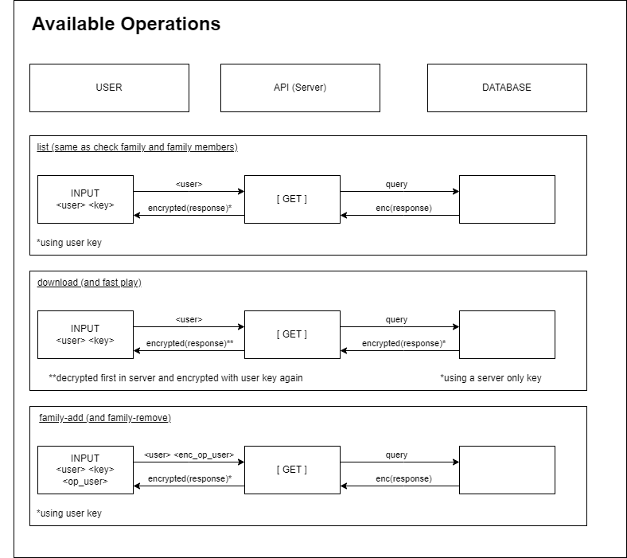

# C54 GrooveGalaxy Project Report

## 1. Introduction

This report delves into the foundational pillars of GrooveGalaxy:
```
1. A meticulously designed secure documents library fortified by AES keys and CBC mode encryption

    Available modes: 
    - Standard mode
    - Fast mode (TODO) (security challenge part I)


2. A robust infrastructure that seamlessly balances scalability and security

    Four machines were used for our tests, however this can support
    multiple clients, servers and database servers.

3. A simple and robust way for users to share musics with other users

    Despite its simplicity, this system maintains elevated levels of security,
    ensuring that users can revel in their musical passions with unwavering confidence.
```


Aditional notes: *key in users and *music_data in musics are encrypted fields


## 2. Project Development

### 2.1. Secure Document Format

#### 2.1.1. Design

```
As the internet operates within a public domain, its usage inherently
involves the risk of unintended interception of our messages by 
unauthorized entities. To address this concern and fortify security measures, 
we incorporated an additional layer of protection within the application framework.
This involved the development of our proprietary encryption library named 'sirs-crypto'.

Our library addresses all the essential facets required to uphold the security of our application,
including ensuring confidentiality between the user and server, authentication, 
integrity, and freshness. Each component within the library resolves a distinct aspect
of these security concerns.

1. Confidentiality: Within our framework, we operate under the assumption that 
both the server and client share a secret, enabling the use of symmetric key 
cryptography to obfuscate information. Access to the content of this information
is restricted solely to those possessing the key, thereby ensuring its confidentiality

2. Authenticity and Integrity: We introduced an additional header containing the hash (digest), 
encompassing the message to be sent along with the appended key (MIC/MAC). This implementation ensures 
that any tampering attempts with the content of the key are detectable by both the
server and client, safeguarding the integrity of the transmitted data.

3. Freshness: Furthermore, we augmented the system by incorporating additional information 
indicating the timestamp of message transmission. This measure effectively mitigates 
replay attacks, where an unauthorized listener stores encrypted messages to retransmit to 
the server, thereby preventing unauthorized access or manipulation.
```

### Data example
```json
{
  "Digest": "ccf1a07a73cce371dd3cb0392c4afe1e90d499bdbc681a4de58ca37e2804b207",
  "Encrypted_data": "zdbDP8HRQCFl+cqKWMdBOcUODvcvu8yizIg+rKyMmjCLoPMjlHeS6w3HifqBBXdfSg1mDqiaNjxnJnyPC+4/FdmMB0z/fKRWAcsaKxclPuRZEkDB7Pm0ymaCEyps3ZEvjt4ci0M8ThxC6jKr4+Q
  +n8iUzysyAnHA0hlR6i1hghvXrtt3OyycT7Jo73oEUF0B6T1q9ED0DV7e914Bf5ww4oaDmj4fJqMF0RTRhQgVLXbucOBKDxwoUSRk4jAfZHFrmGh3jk0qlGGTZ+CV3OP7KHzi8gZI2LZpXo+T5eYN/
  5KuCyhgMaXGQRfBFQaGZyYLpRxsHv/1FvxjWsvdidPCGAXGKDqGwIOTPDSTlK1vyTvyxgOzBklAdt2+4eefqAzEz0Q1AbFO32VUkE3L+2qCtTyIvNkDkne/65yDIye/DZ53M7VhI6VS8WtIKTjUdD2uHcHPxvvWUUO3K/
  KWjhdQSoaR2SlBFHA8ZGFZGQFEOgOeUrxH/7xrq7yc96cmllZ95Awyb1hYEmByYZwbZA2wIOmgnD7GbAmEF7oQvhVQCSuYVr7FI09LvXVaJGSOGEb6LmwWlBAQUeQ+lKTgb3PXS3XyYOLeTaIEYC/dDDG1crjtDprw/
  Uv45ySXyHCa4N678ZPB8qDmxnhWgk94vcnzawOsLwzU0CZ0tv6TSNkmcLDyKpMbsInKrc4XIWDDCunSnEs7pLLfWwlLQmLgR91awX/N4FHtwselRkfIu7BS7CkEAii/
  X6K33KKVmNlmtSWpjrql1Im8VSvqkjLunUI6T93s4Sq5CIMU4TWiOh0wYrBNJpTnSiKyY4U7F5K3V/ehbD+Y4N91
  vh86tyvmbnigqjROOUV1EpeCAVFGqQlICAqEYf2m9/Ri+P8ZWu/SnNN6C9yFimxHDKa/KHIDlL2+9N2e1+diAk49FYUWdGdx0hql+QJ1Qdh/
  A6igWQKuG89rTZDU4LcA6SlOC63CA07tf5BAXSFf2zTAtzYlhcN9Wh6HBYwnpkXCkgvB5aSaja1h4XvskdcFZ3ygh0EjgXiYkV2c87T2mIU7qwfAbuzdJ8glzCERp+ehO+bNAAvIAdPPbpxpRPxq+vydUMKCId3pxAC
  +MjSR8tyQn8fWh3tDrXykFwhhTnM4MkK4eYzWxpDxsFizKZ92nbxuxUlEyXoprpHtMwo2UCnH8R+RAcrZvOaEORd8P5+sQwaSDMGTgL6/T5Yf/O4j5v/hEjPeyLKWUNchAVmQhBCCnGNBdKt+KzsQj5co08W0jvsGRdw6
  +8fUWEcNCaV8sbtEb6NQaIdnqItOHZe7VtxqQFznDpmml5bqat2Js/r+N/Rmu1bQN4G7gYY00Lm5QPNKYtgNeI5PHFpkxkfRXHLZQsFYSZE5xL/VPH4xEgisUc/D9FH/SdQG0E5lg+J3oaFZEyhHaGRO7pF1lZuOBHQrN/
  WELNmRLaLdE8GLQqQVWWUsEYlhKnefjMVp+MubLVInM9tofLdtHtCcMnraOCg1HF4nc6xDMlmwdoKCziQsXsOltaD25+tZrUtCap8dXq739g6/yvGsnmE0PBpdbv/XjbSuIXudGkT1VGsOLcuMVh5ti7B57zFbBSmIOhM=",
  "IV": "9phCtjkwU2yyMyVT6G/iww=="
}
```

### Data explained
```
Digest: hash(data + key)
Encrypted data: encrypt(data)
IV: A secure number generated randomly

Data: music-content and fresh-token
```

#### 2.1.2. Implementation

Initial choices:
```
In the realm of development, our team collectively opted for Python as the programming language
due to the unanimous confidence among members regarding its capabilities. Subsequently, 
after careful consideration of available tools, we selected Flask to manage the server's API,
and Postgres as the database server for our project.

Python also offers a robust cryptography module, which significantly facilitated the efficient development
of 'sirs-crypto.' Its compatibility with our intended features was instrumental in implementing key aspects
of our library, including symmetric key cryptography (AES), CBC encryption mode, and padding mechanisms.
```

Where are the keys?
```
Client-Server Keys: Each user possesses a secret key, which 
        is securely stored on both the client and server ends, initially 
        constituting the shared secret. This key exclusively enables 
        secure communication between the user and the server. 
        All resulting operations involve an encryption component 
        at some level. For a [GET] request, the server's response 
        undergoes encryption using our library, ensuring message 
        authenticity, confidentiality, freshness, and integrity. 
        Conversely, for a [POST] request, the server mandates 
        encrypted messages from the client, thereby guaranteeing 
        the same properties in the reverse direction.

Server-Server Keys: In order to maintain communication integrity 
        between the database and server, an additional key system has been 
        implemented. This system allows for a more generalized encryption of 
        the database content, preventing data duplication within the database, 
        as would occur if we were to encrypt the database content using 
        individual client keys. To streamline this process and due to the 
        limited number of songs and clients, our server and database share a 
        singular key (alpha_server.key). This key serves the purpose of 
        encrypting the entire database content. However, this consolidation 
        of trust into a single key poses inherent risks due to its pivotal 
        role in the encryption process. To address this concern, 
        we've implemented an auto-rotation mechanism where the 
        server updates its key (alpha_server.key) after every X 
        client operations. For academic purposes, X has been set 
        at 10 to facilitate monitoring and validation of this 
        mechanism's functionality. However, while this frequency 
        allows for demonstrative functionality, the chosen value of 
        10 presents efficiency challenges. This is primarily due to 
        the computationally intensive nature of encryption operations, 
        especially when dealing with substantial music content, 
        making frequent key rotation burdensome in terms of efficiency.
```

Some challenges faced:
```
The missing key: The most challenging aspect encountered during our project's execution pertained to ensuring 
        both integrity and authenticity. Until the final stages, our team continuously computed the 
        hash of the content alongside the freshness token. Despite this, it seemed inadequate for 
        achieving our desired level of security. We collectively acknowledged a missing element,
        yet amidst other project concerns, this detail eluded our immediate attention. It was
        only in the project's concluding phase that the realization struck—we needed to 
        incorporate the 'secret' (the key) into the message for it to be truly effective
```

### 2.2. Infrastructure

#### 2.2.1. Network and Machine Setup

(_Provide a brief description of the built infrastructure._)

(_Justify the choice of technologies for each server._)

#### 2.2.2. Server Communication Security

(_Discuss how server communications were secured, including the secure channel solutions implemented and any challenges encountered._)

(_Explain what keys exist at the start and how are they distributed?_)

#### 2.2.3 Some challanges faced:

```
SSH and firewall config: Synchronizing the SSH tunnels 
        with the firewall posed another significant difficulty. The sequence of configuration 
        commands wielded a substantial impact on the ultimate outcome. Consequently, 
        extensive analysis of packet traffic became imperative to rectify
        the resultant complications.

Time: While an immensely intriguing and comprehensive project,
        its scope proved to be notably extensive. Given the limited timeframe
        at our disposal, resolving every aspect became a considerable challenge.
        Despite nearly achieving our envisioned goals, certain elements
        remained incomplete. A detailed list of these outstanding 
        components will be appended to the conclusion of the report.

Multiple machines in one PC: The necessity to configure multiple virtual machines 
        on a single computer, while seemingly straightforward, significantly strained 
        the system's resources. Consequently, witnessing the 
        project in full operational capacity became a challenging and time-consuming 
        endeavor. It was only in the final days that we could 
        ensure its seamless functionality.
```

### 2.3. Security Challenge

#### 2.3.1. Challenge Overview
```
Our challenge unfolded in two main facets:

1. Implementing playback to initiate audio playback midway through 
an audio stream. This challenge necessitated the addition of a
new decryption mode compatible with this objective. Unfortunately, 
due to the existing time constraints, the group was unable to finalize 
this task within the allocated timeframe

1. The second part involved an additional feature aimed at enhancing
the user experience, focusing on music sharing among users. 
Introducing the concept of "families", users were empowered 
to share their music libraries with others by adding them to 
their 'family.' Once added, the designated user gained access 
to the shared music collection. However, it's important to note 
that the familial relationship isn't reciprocal. To access another 
user's music, one must wait for explicit inclusion into their family.
```
#### 2.3.1.1 "Fast-Play"

// NOT COMPLETED YET (missing-Features - See below)

#### 2.3.1.2 "Families"

```
Finalizing this challenge necessitated a comprehensive redesign of all 
existing operations. This involved a fundamental overhaul in how we 
stored information in the database and the addition of new operations to 
facilitate client interaction with this feature. This overhaul was crucial 
to accommodate the newly introduced functionality seamlessly within 
the application's framework.

Developing this feature demanded meticulous attention as any inconsistency
could pose a significant security risk to the final product. To uphold 
stringent access control for end-users, we opted for a minimal access 
approach wherein the user retains only their key as proof of identity. 
Despite acknowledging the inherent vulnerability in keys, we adopted a 
straightforward solution—key substitution—to mitigate potential 
vulnerabilities. (This is one of the missing features - See below)
```

#### 2.3.2. Attacker Model

Trust model
```
Fully trusted: Our API machine

Partially trusted: Registered users (can access their keys)

Untrusted: Not registered users and Database*

*Our system does not inherently trust the database; 
even if a user gains root access to the database, 
retrieving valuable information remains unfeasible. 
This is primarily due to the comprehensive encryption 
measures in place, ensuring that all sensitive data 
remains adequately encrypted. Additionally, 
decryption access is limited solely to the API
machine, which possesses the requisite key for decryption.
```

Atacker capabilities
```
Our system architecture is designed to thwart attacks by necessitating 
access to the rotating alpha key. This dynamic key rotation feature 
significantly mitigates the feasibility of a successful brute force 
attack within a feasible timeframe. However, despite this precaution, 
the alpha key remains exposed and could potentially be the most 
vulnerable point of entry for an attacker. Gaining root access to 
the API machine, albeit challenging, could 
represent a plausible attack vector.

Our server is susceptible to DDoS attacks, presenting a potential vulnerability 
in our service. Unfortunately, at present, we lack specific defense mechanisms 
to mitigate or prevent such attacks. However, considering the multimedia nature 
of our content, while the vulnerability is a concern, it doesn't pose an immediate 
severe threat, as continuous, uninterrupted service delivery throughout all 
365 days of the year, 24 hours a day, may not be an absolute necessity

We acknowledge operating within a complex and intricate landscape, thereby 
recognizing the possibility of vulnerabilities that might have eluded our 
attention due to sheer unfamiliarity. However, we've diligently addressed 
the most prevalent vulnerabilities and are confident that our code isn't 
susceptible to common attack vectors. Nevertheless, the nuanced nature of 
our service implies the potential for unforeseen vulnerabilities that 
might exist beyond our current scope of awareness.
```

Atacker Limitations
```
Our security framework heavily relies on robust encryption practices, 
leveraging the inherent complexity of cryptographic problems, which 
currently lack easy resolutions. This cryptographic foundation stands 
as a cornerstone of our security infrastructure, augmented further 
by the rotation and time-bound nature of all keys. This rotation 
mechanism inherently limits an attacker's window for key discovery, 
thus serving as a deterrent against brute force attacks. Moreover, 
all interactions, including messaging and database access, adhere 
to these stringent encryption methods. Additionally, our chosen 
communication protocols, such as HTTPS and SSH, contribute an 
added layer of security, fortifying our system's overall 
security posture.
```

#### 2.3.3. Solution Design and Implementation

```
To finish the proposed challenge, our service extension required minimal overhaul, 
given that the majority of the project was developed with the challenge's context 
in mind. However, we did need to expand our operations to ensure compatibility with 
the 'families' feature and implement key updates to uphold security measures.
The 'fast play' aspect of the challenge would have necessitated further expansion 
of our cryptographic library, which regrettably remained unresolved.

Previously, each client possessed an encrypted copy of their 'purchased' 
music stored in the database, encrypted with their respective keys. However, 
this individualized encryption approach posed challenges in facilitating 
exclusive content sharing. To streamline this process, we introduced an 
additional layer of keys, simplifying the structure by maintaining a single 
key shared between the server and the database. Consequently, upon 
database requests, only the server holds the decryption capability, 
centralizing the music within the database. This revised setup grants 
exclusive access to music by allowing the server to manage and control 
client access permissions to specific songs.
```
 


## 3. Conclusion
```
In general, we achieved most objectives successfully, except for the 'fast play' feature.
This project proved to be an extensive learning experience, 
offering insights into the challenges developers face while striving to create 
an engaging and valuable product for clients while upholding robust security 
standards. Many implemented features, despite their apparent simplicity, 
necessitated additional complexity due to the stringent security measures 
in place. While the final product is a simplified version compared to a 
real-world application, the project underscored the intricate balance 
between functionality, user interest, and maintaining a steadfast 
commitment to security.
```

```
Secure documents: SATISFIED
        (check 2.1)


Personal account: SATISFIED
        Each user account encompasses comprehensive details and privileges 
        necessary to access and utilize our service, including music 
        access and content sharing capabilities among members. 
        These accounts encapsulate all essential information 
        required for users to fully leverage our platform's offerings.

Buy new musics: NOT SATISFIED
        We refrained from implementing a purchasing capability for
        users due to the additional complexity involved 
        in managing a credit or monetary system.
        Additionally, we deemed this functionality to be outside the defined scope of the project.

Download and play musics: SATISFIED
        Users with access to a particular song can either listen to the music directly 
        or opt to download it for offline listening at a later time. This feature 
        provides users with the flexibility to enjoy the music either through 
        immediate playback or by storing it for future access.

Fast play: NOT SATISFIED
        Once again, it's important to note that due to 
        time constraints, we were unable to complete this 
        requirement. Recognizing its relative independence 
        from the core project functionalities, we had 
        planned to address this aspect towards the project's 
        conclusion. Regrettably, due to group constraints, 
        we were unable to successfully implement this functionality.


Family members: SATISFIED
        Regarding the 'Members and Family' functionality, 
        our evaluation indicates that all aspects and 
        features have been successfully 
        implemented as intended. We are satisfied 
        with the outcomes achieved in this domain.


## PASCOAL METE AQUI REQUESITOS DE SEGURANÇA NA REDE ##
```


For the future
```
As part of our future roadmap, we aim to incorporate the 
functionalities that were left unfinished in this iteration. 
Additionally, we intend to introduce a key rotation method for 
clients, further enhancing the security measures of our service.
```

## 4. Bibliography

- [Python 3.9.0](https://www.python.org/downloads/release/python-390/)
- [python docs](https://docs.python.org/pt-br/3.9/index.html)
- [cryptography 41.0.7](https://pypi.org/project/cryptography/)
- [Flask 3.0.0](https://flask.palletsprojects.com/en/3.0.x/)
- [Postgresql](https://www.postgresql.org/)
- [pg-docs](https://www.postgresql.org/docs/)
- [pgAdmin](https://www.pgadmin.org/)
- [flask-https](https://blog.miguelgrinberg.com/post/running-your-flask-application-over-https)

## 5. Missing features

```
1. Fast-Play (one of the challange requirements)

2. Update Key request: Given that a user possesses a 
        single key, any compromise of this key inherently 
        compromises the user's security. Therefore, our team 
        intended to incorporate a key update mechanism wherein 
        users could request a new key, facilitating automatic 
        key rotation. This addition aimed to bolster user security 
        significantly, fortifying the system against potential 
        compromises. However, due to time constraints, the 
        implementation of this mechanism couldn't be 
        completed within the project's scope.
        (This is not mandatory but we wanted to 
        implement this)
```

----
END OF REPORT
